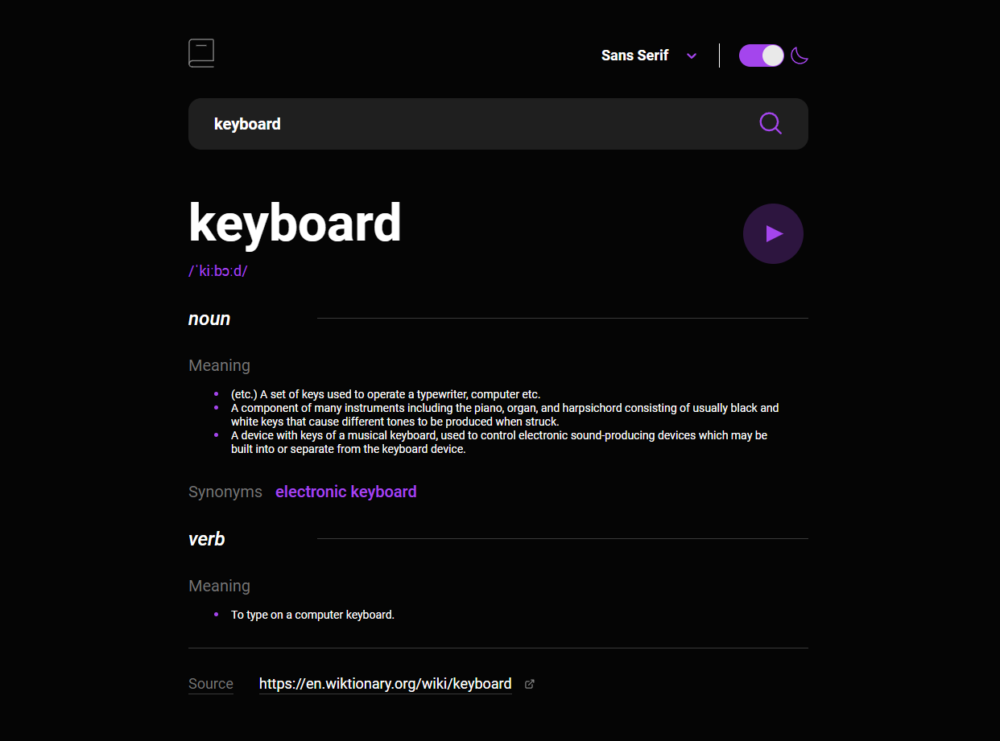
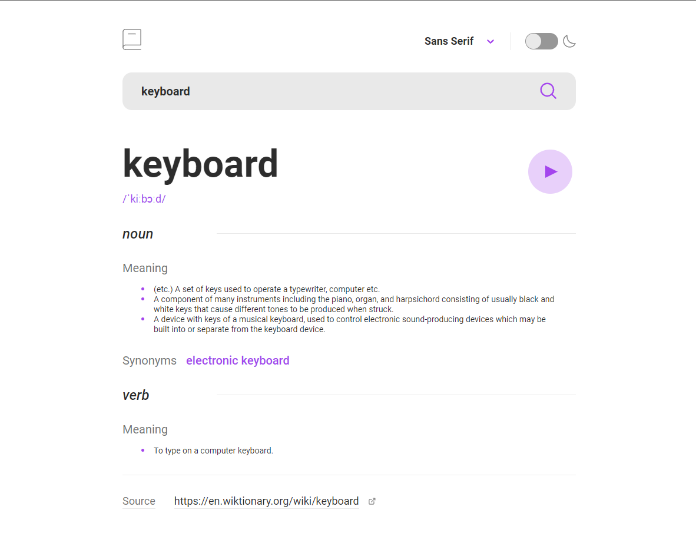

# Dictionary App

This project is a dictionary app that allows users to search for terms through a search bar. The app leverages modern
web technologies such as Vite, React, TypeScript, Formik, SCSS, Axios, React-Select, and React-Switch to provide a
seamless and responsive user experience.




## Table of Contents

- [Features](#features)
- [Technologies Used](#technologies-used)
- [Getting Started](#getting-started)
- [Installation](#installation)
- [Usage](#usage)
- [Project Structure](#project-structure)

## Features

- Search for terms using a search bar.
- Display search results, including handling empty results or errors.
- Display validation errors for input fields.
- Toggle between three font families: sans-serif, serif, and mono.
- Toggle theme mode between dark and light.
- Responsive design for optimal viewing across various devices.

## Technologies Used

- [Vite](https://vitejs.dev/): Fast, opinionated web framework for React and more.
- [React](https://reactjs.org/): JavaScript library for building user interfaces.
- [TypeScript](https://www.typescriptlang.org/): Strongly typed superset of JavaScript.
- [Formik](https://formik.org/): Form library for React to handle form validation and submission.
- [SCSS](https://sass-lang.com/): Syntactically awesome style sheets.
- [Axios](https://axios-http.com/): Promise-based HTTP client for the browser and Node.js.
- [React-Select](https://react-select.com/): Customizable select component for React.
- [React-Switch](https://github.com/markusenglund/react-switch): Simple, accessible toggle switch component for React.

## Getting Started

To get started with this project, follow the installation steps below.

## Installation

1. Clone the repository:

    ```bash
    git clone <repository_url>
    ```

2. Navigate to the project directory:

    ```bash
    cd <project_directory>
    ```

3. Install dependencies using your preferred package manager:

    ```bash
    npm install
    # or
    yarn
    ```

## Usage

1. Start the development server:

    ```bash
    npm run start
    # or
    yarn start
    ```

2. Open your web browser and navigate to [http://localhost:5173](http://localhost:5173) to use the dictionary app.

## Project Structure

The project is organized as follows:

- `src/`: Contains the source code for the application.
    - `assets/`: Contains static assets such as images.
    - `components/`: React components used throughout the application.
    - `context/`: AppContext and handling of global state (theme, font, etc...).
    - `styles/`: SCSS styles for styling the application.
    - `App.tsx`: Main application component.
    - `main.tsx`: Entry point of the application.
